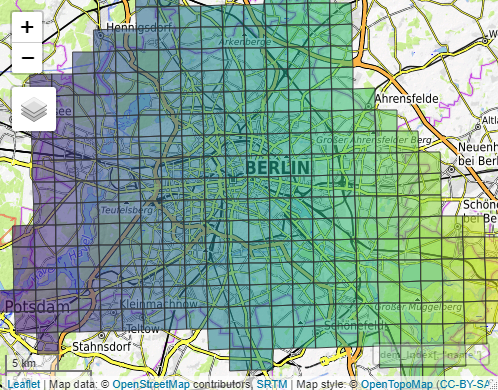
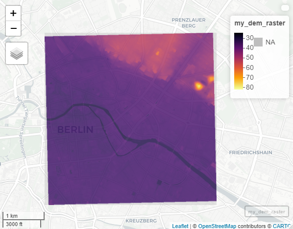
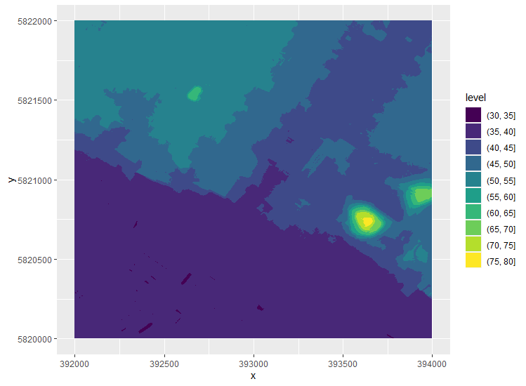
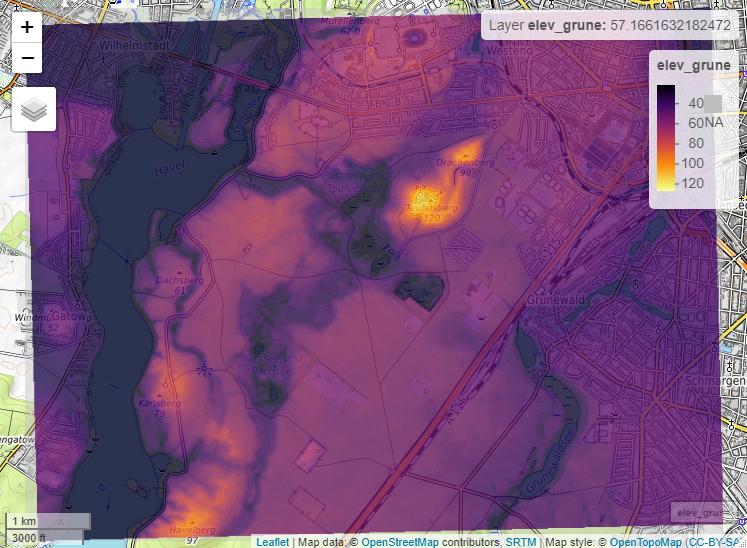

<!-- README.md is generated from README.Rmd. Please edit that file -->

# rbem

<!-- badges: start -->

<!-- badges: end -->

The goal of rbem is to provide an easy interface to the 1m resolution
digital elevation model of the city of Berlin provided by the
[Geodatenportal Berlin](https://fbinter.stadt-berlin.de/fb/index.jsp)
under the “Datenlizenz Deutschland” (see: [Geoportal Berlin / ATKRIS(R)
DGM (1m-Rasterweite)](https://www.govdata.de/dl-de/by-2-0))

## Installation

You can install rbem from [GitHub](https://github.com/) with:

``` r
# install.packages("remotes")
remotes::install_github("Ignimbrit/rbem")
```

## Example 1: Select data by coordinates

The digital elevation data of Berlin is available in quadratic tiles of
2x2 km length. We can examine the available datasets with a little help
from package [mapview](https://github.com/r-spatial/mapview).

``` r
library(rbem)
library(mapview)
library(ggplot2)

data("dem_Index", package = "rbem")

mapview(dem_Index[, "name"], legend = FALSE, map.types = "OpenTopoMap")
```



Let’s assume you have a specific area of interest within Berlin for
which you would like to acquire digital elevation data. You can define
that area by providing the boundary coordinates in EPSG:25833
(ETRS89/UTM zone 33N):

``` r

# For this example we take a look at the Alexanderplatz in Berlin-Mitte

Alexanderplatz <- bem_target(
xmin = 391770, 
xmax = 392319, 
ymin = 5819878, 
ymax = 5820353)
```

The resulting object is a rectangular bounding box wich can then be
passed into `bem_data`. `bem_data` is the working horse of the
`rbem-package`. It not only identifies the tiles of available dem-data
that fall into your target area but also handles the download and makes
the data available as R objects. The basic interface ist simple:

``` r

# Carefull! The following command will start the download of 4 tiles
# each of which is ~14 Mb in size and will be saved to your hard disc!
my_dem_raster <- bem_data(Alexanderplatz)

mapview(my_dem_raster)
```



The result is not all that spectacular, for the area around
Alexanderplatz is overall pretty flat. We can see however, that
elevation starts to ramp up in the northeeast towards Prenzklauer Berg,
with two distinct hills located in the Volkspark Friedrichshein: big and
little bunker hill.

## Example 2: Working with different output formats

In the first example we accepted the default settings to `bem_target`,
which means that all downloaded files were automatically merged in a
single object of type
[raster\*](https://www.rdocumentation.org/packages/raster/versions/3.0-12/topics/raster).
This is not always desirable, which is why `rbem_data` also allows to
receive the raw xyz-data with no actual processing.

``` r

my_dem_tbl <- bem_data(
  Alexanderplatz, 
  output_format = "tbl",
  merge_output = FALSE
  )
```

Note that in the code block above `merge_output` is set to `FALSE`. This
means that instead of getting a single object, in this case a
[tibble](https://tibble.tidyverse.org/) (because `output_format =
"tbl"`), we will receive a list with one object per downloaded tile.
Let’s have a look\!

``` r
ggplot(
  my_dem_tbl[[3]], 
  aes(x = x, y = y, z = z)
  ) +
  geom_contour_filled()
```



## Example 3: Select data by overlap with a spatial object

It is not strictly necessary to specify your target area with
`bem_target` but merely a convenience. In many settings it will be more
practical to acquire elevation data for an area for which you already
have some kind of spatial information, maybe because you want to combine
those datasets in some way. To make this as easy as possible, `bem_data`
accepts any object that can be passed on to
[sf::st\_bbox](https://r-spatial.github.io/sf/reference/st_bbox.html)
and subsequently uses the extend of its bounding box to determine the
tiles required for download. Let’s see how this works\!

The highest natural “mountain” in Berlin is the
[Teufelsberg](https://en.wikipedia.org/wiki/Teufelsberg), which makes
this a fun spot to look at in elevation data. The Teufelsberg is located
in the Berlin district Grunewald. We will therefore just download all
elevation data that at least partially falls into this district.

``` r

data("districts", package = "rbem")

Grunewald <- districts[districts$name == "Grunewald", ]

# Carefull! The following command will start the download of 12 tiles
# each of which is ~20 Mb in size and will be saved to your hard disc!
elev_grune <- bem_data(Grunewald)

mapview(elev_grune, map.types = "OpenTopoMap")
```


